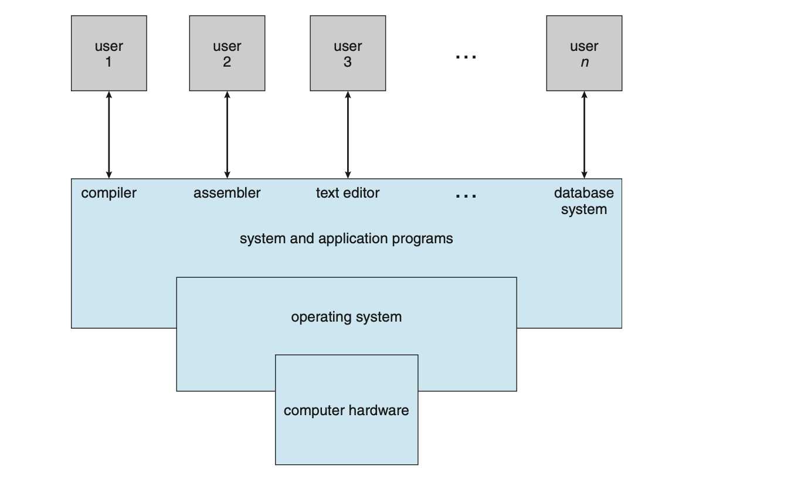
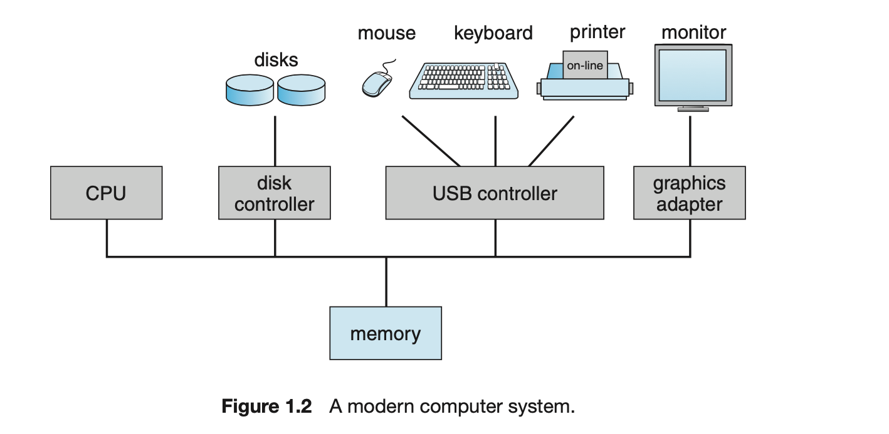
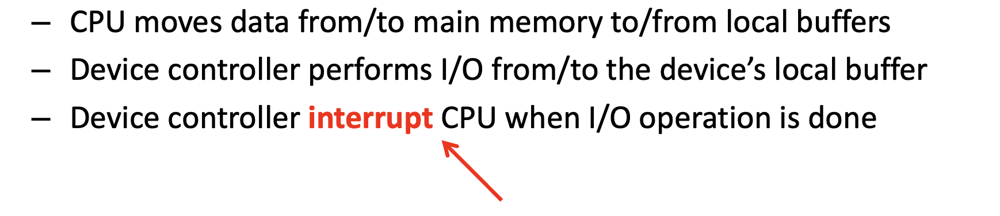
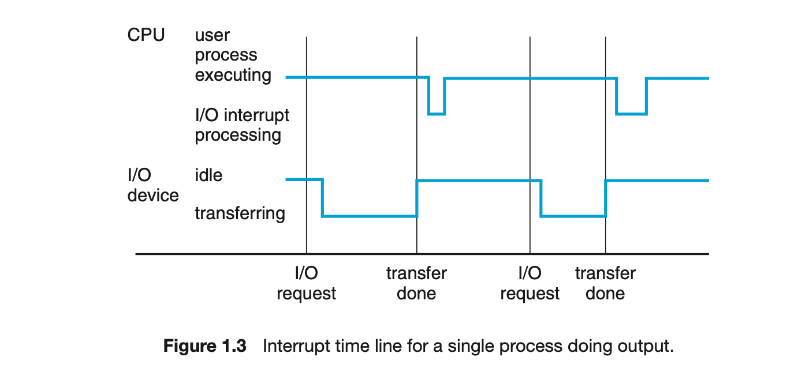
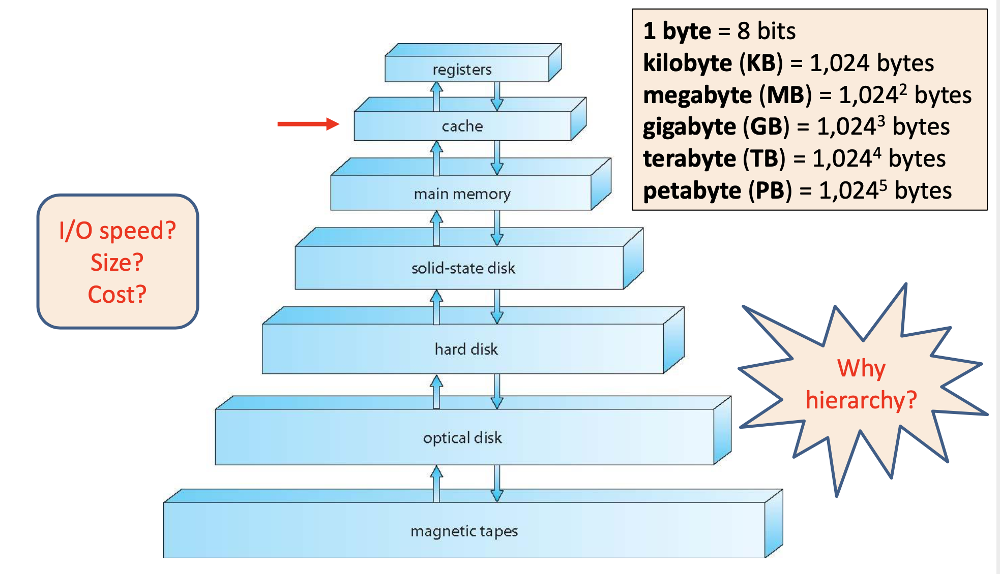
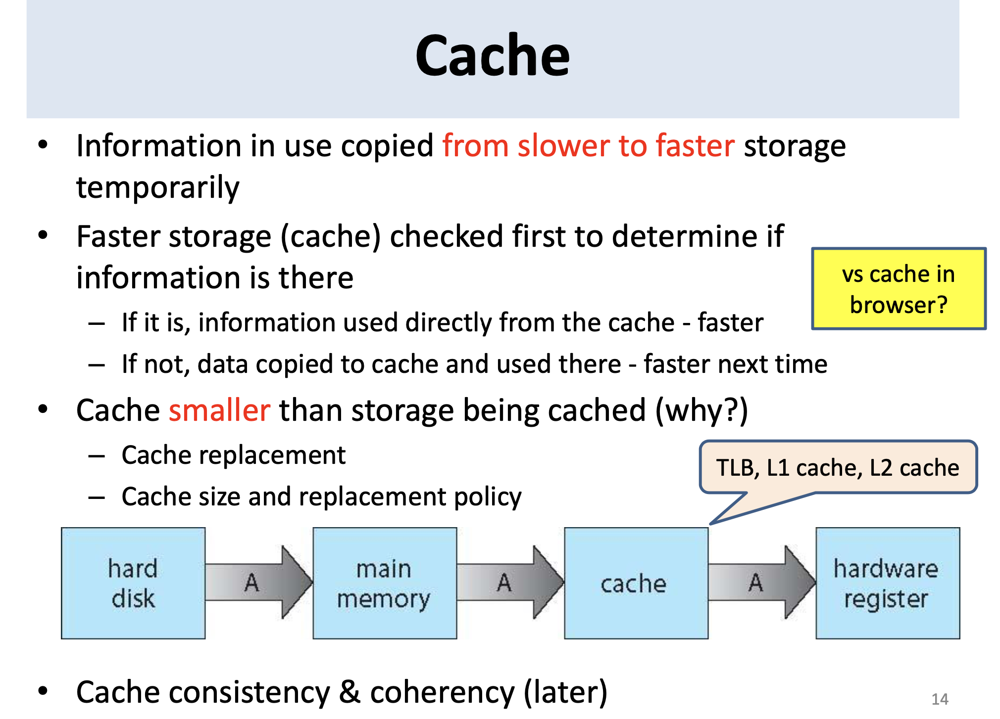

### What is an Operating System?

#### A program that acts as an intermediary(中间的) b/w user and hardware

#### Goals:
- Facilitate(促进) user to execute programs
- Make the computer system convenient to use
- Use the computer hardware in an efficient manner(方式)

### What Operating Systems Do?
- Depends on the point of view
- User View
    - ease of use && good performance
    - Don't care about resource utilization(资源利用率)
- Shared computer (e.g., mainframe(主机), minicomputer(微型电脑), server, headless)
    - keep all users happy
- Users of dedicate systems专用系统的用户 (e.g., workstations)
    - have dedicated resources
    - frequently use shared resources from servers(频繁使用服务器上的共享资源)
- Handheld computers(掌上电脑)
    - much less resource(资源少得多)
    - optimized(使最优化) for usability and battery life (针对可用性和电池寿命进行了优化)
- Some computers have little or no user interface
    - embedded computers in devices and automobiles (real time OS) 设备和汽车中的嵌入式计算机（实时操作系统）

### Operating System Definition
- OS is a resource allocator(操作系统是资源分配器)
    - Manages all resources
    - Decides b/w conflicting requests for efficient and fair resource use 在有效和公平使用资源的冲突请求之间做出决定
- OS is a control program
    - Supervise exec of programs to prevent errors and improper use of the computer 监督程序执行程序，以防止错误和错误使用计算机
    - Manage and control I/O devices
- OS Definition
== "The one program running at all times on the computer"
== kernel(核心)

- Everything else is either
    - a system program (ships with the OS) , or
    - an application program

### Computer System Organization

- One or more CPUs, device controllers connect through common bus(es) providing access to shared memory 一个或多个CPU，设备控制器通过公共总线连接，以提供对共享内存的访问
    - I/O devices and the CPU can execute concurrently(同时发生地) I/O设备和CPU可以同时执行
    - CPUs and devices compete for memory cycles CPU和设备争夺内存周期

### Computer-System Devices
- **I/O devices and the CPU can execute concurrently** I / O设备和CPU可以同时执行
- {OS -- device driver} <-> {device controller – device}
- Device Driver 设备驱动
    - Device-specific, manageI/O
    - Provides uniform interface between controller and kernel 在控制器和内核之间提供统一的接口
- Device controller 设备控制器
    - Each in charge of a particular device type 每个负责特定设备类型
    - Each has a local buffer 每个都有一个本地缓冲区
- I/O operation

    - interrupt(中断)
- Device controller interrupt CPU when I/O operation is done; I/O操作完成后，设备控制器中断CPU

###  Interrupt Timeline 中断时间表

### Interrupt Vector & Handling

### Storage Structure 储存结构
- Main memory – only storage media directly accessible by CPU
    - Random access 随机访问
    - Typically volatile(不稳定的)
- Secondary storage – extension of main memory, large nonvolatile storage 辅助存储–主内存扩展，大型非易失性存储
- Hard disks –metal or glass platters covered with magnetic recording material, nonvolatile 硬盘–覆盖有磁性记录材料的金属或玻璃盘片，非易失性
    - Sectors, tracks, cylinders
    - disk controller: interaction between the device and the computer 磁盘控制器：设备与计算机之间的交互
- CD, DVD, etc.

### Storage-Device Hierarchy 存储设备层次结构

### Cache 电脑高速缓冲存储器
