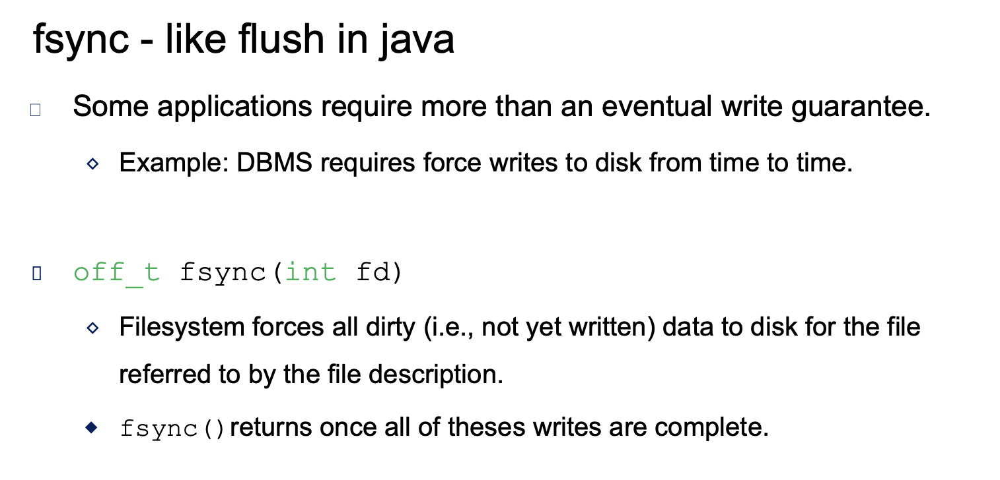
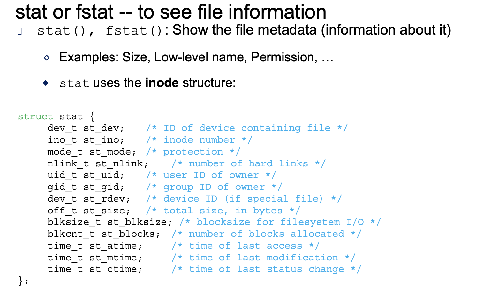
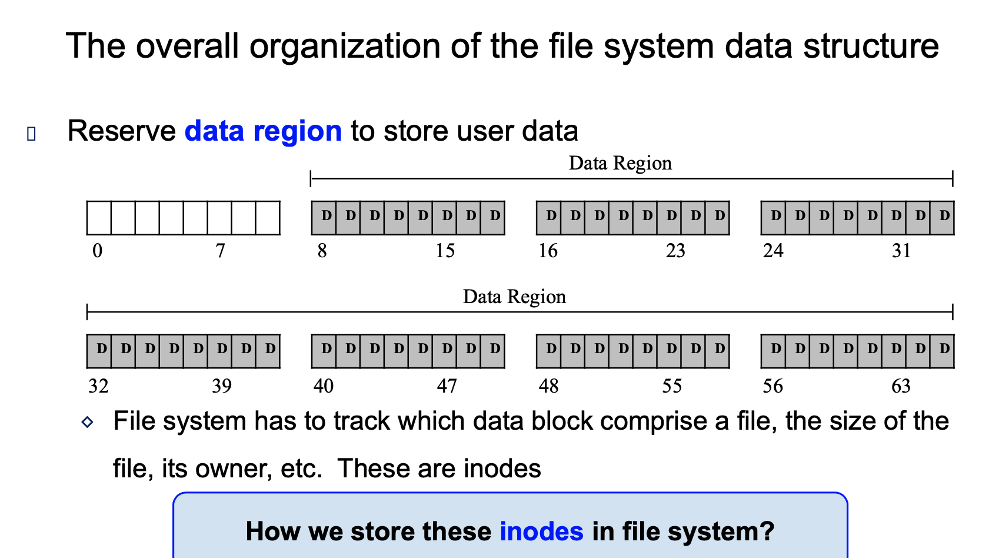
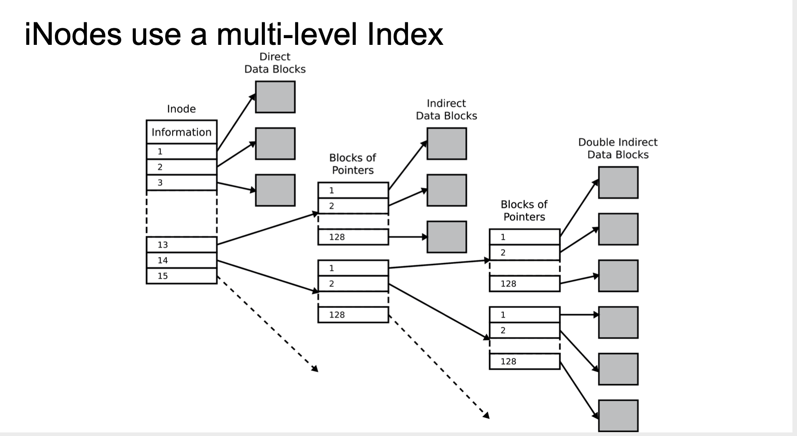
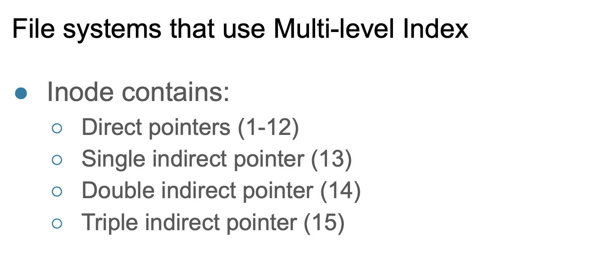

- Persistent Storage 永久存储
- Solid-state storage device 固态硬盘

---

- a, case-sensitive 区分大小写

---

- a, most unix system, you have many more orinary files than directory files

---

- b

---

- a

---

- b

---

- [file descriptor](https://novemberfall.github.io/programming/#/operation/dup)

---

- a

---

---

---

---

---

- it's in outsiede data structure

---

---

## File System Implementation

---

---

- Cluster(群，串) or Block
- **A file is a linked sequence of clusters.**

---

---

- A

---

- c
---

- 2

---

---

- dentry : 目录项

---

---

