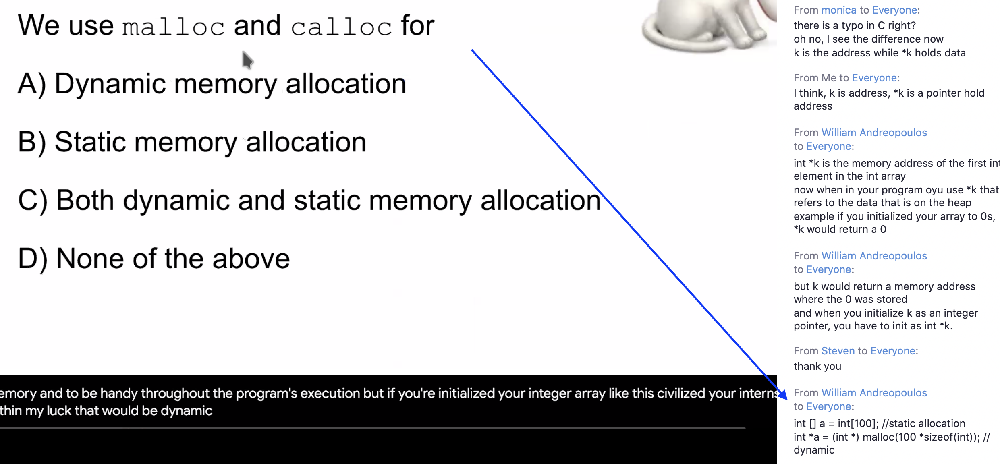

## Address Space

---

---

---

---

- A

---

---

---

## Memory API

#### Heap access

- the problem is that after `int *ptr` declaration. This pointer has a random
  value. This pointer point to a random location in memory.
  it's assigning 10 and 22 random location in memory, which could be
  anywhere. Which means that you're accessing it's a segmentation fault, 
  which means your're accesing something outside of your memory space. 

---

---

## Issue

#### Memory Leak

#### Dangling Pointer

- the problem here is that when you're calling the function. This is going
  to allocate a new stack frame for the parameters that get passed in which 
  in this case is and enter the point `a`. And when this function completes. 
  That stack frame is not going to exist anymore. So essentially, `a` is 
  local variable for that function called.

## calloc()

---

---

- p1 has problem is that returning is a memory address to a local variable,
  when the function complete, the stack gets deleted, you're returning the
  address of x, but that variable x is a local variable that doesn't exist 
  anymore. so you return the address of x, x is gone.  
- p2, that problem is we have talked about previously. you have to call
  `malloc()` for `int *px`,  
- p3, this function is returning the address of pointer

---

