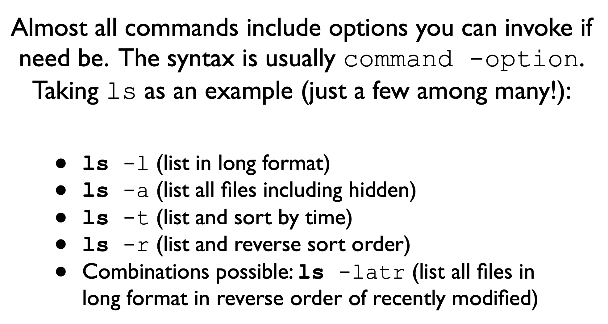
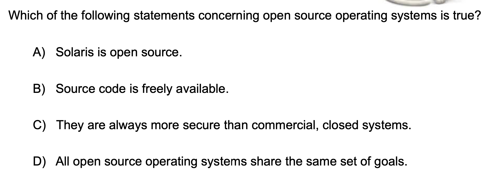
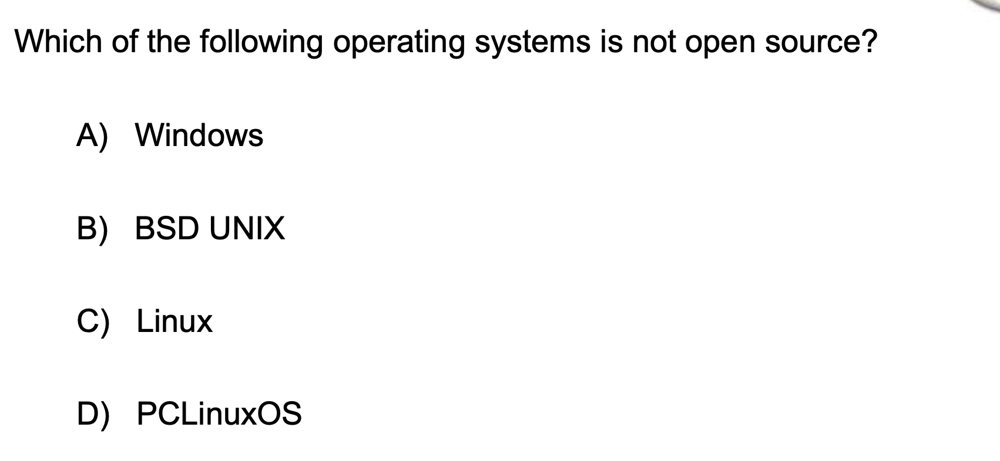
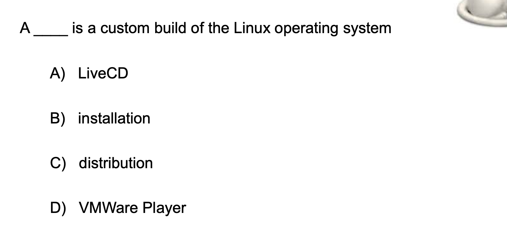

## command line 

## iclicker question

- Virtualization software differs from emulation.
  - **False**, this question is to get you think about what a virtual machine that we're using really
    is. So the virtual machine is basically emulating an operating system on top of another operating
    system. you basically have a confined Environment in a way it's you're emulating Ubuntu to on top
    of your underlying native operating system which might be MacOS or Windows. So virtualization 
    software is basically emulation software

- A virtual machine can be switched like a process in the operating system
  Yes, the virtual machine is basically just another process on your operating system and you can do
  do our context. Waits in from other processes to that process. It's emulating a whole operating 
  system. So you probably might want to power it off before go to sleep.

- An operating system is far easier to port-to move to some other hardware-if it is written in a 
  lower-level language
  `False`,  Like if you load your entire operating system in assembly. That would be like very 
  difficult to put one other fired work with a different instruction set architecture assembly offers 
  defined benefits like you get low level access to the registers and to the CUP into the stack. But 
  you don't want to entire operating system in assembly, becuase it's going to be very difficult to 
  parse it, that's the reason why we provide an operating system in C or c++ because if you haven't 
  have c/c++ at least get us need to ensure that your compiler will compile the code and then you can 
  compile the code for any other side where architecture(架构).
  And you can still provide some level functionality in assembly, but that needs to be rewritten for 
  for every new instruction set architecture. so the answer to this one is `False`. You want all of 
  your other functionalities to be in C or C++ so that we can compile them for new hardware
  architecture.
---

- B is `True`
- Solaris is not open source
- open source is not necessarily more secure than Commercial code, because anyone can find 
  vulnerabilities.
- And open source OSS have different goals. So it's not that they all have the same goals.

---

- Distribution is the name, so when you have a custom build an open source of system that's called
  the distribution 