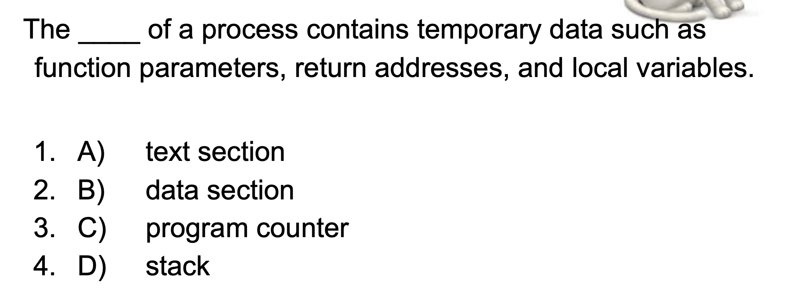
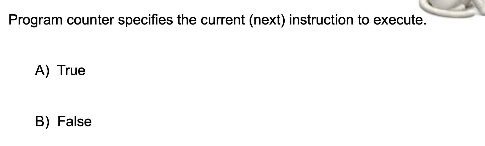
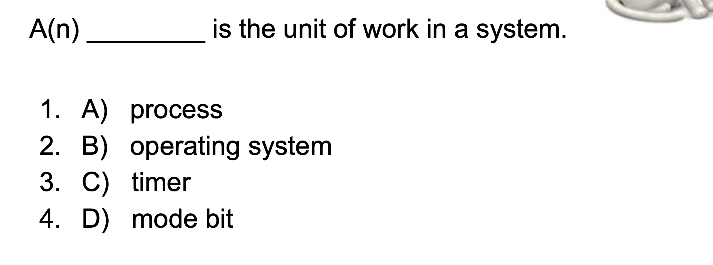
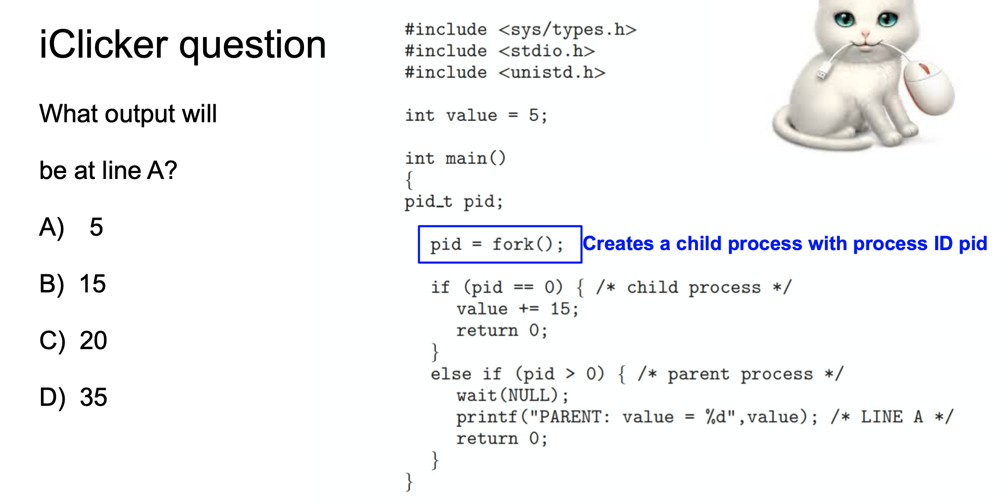
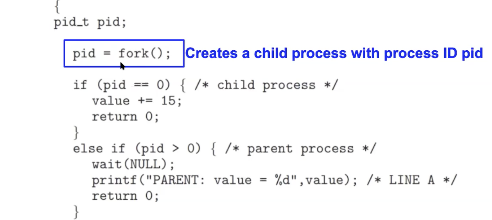

## The Process

- Time Sharing

## iClicker question

- In an OS is a "program" the same as a "process"?
  - False, the program is the executable that actually exists on the file system, but once
    it gets it comes to life. This is what the process is. 


- A new browser process is created by the Chrome browser for evey new website that is visited.
  - False, every time you visit the new website. It's still the same process, which is the Chrome
    browser that is the program running. And when you visit a new website that's not going to 
    necessarily spawn off a brand new process. Right, it's still like just a website that is 
    downloaded from the internet into your browser and your browser is the running process. 
    so if you look at the processes. On your mark, for example, you would find that Chrome is one
    of the processes that is running in the back end.

---


- Stack is what will contain function parameters, and that's because the stack is used for
  recursion purposes.



- True, program counter is a register which keeps track of weeds instruction is currently 
  executing.



- A , the process is exactly what is defines the unit of work in an operating system.

---



- A
- because when you call Fork(), the same code base is going to be copied into a new
  process in a new address space and execution in detail This is going to continue from 
  the next line when your code is executing and you call for this entire code base is 
  going to be copied into a new process. Your child process has a `PID` of 0, because we
  mentioned before, a couple of slides ago, **every process has its own `variables`**. 
  so the `PID` in the child process is still on initialize so it's still 0. So the child
  process can do anything it wants to value like it could set the value to any value with
  wanted but that will be different from the current process.
- So the parent process, the `PID` is not 0. It's greater than 0. So in this line

```c++
else if(pid > 0){
    wait(NULL);
    printf("PARENT: value = %d\n", value); //LINE A
    return 0;
}
```
  the value has not been affected values still 5.



- 总结： `pid` is also variable, In child process `pid == 0`, 
  but in parent process, `pid` is actually set to be the result of `fork()`, 
  for here(parent process), `pid` will contain the result of `fork()`, which is the process
  ID of the child.

---

## The value fork() returns

- Upon successful completion, fork() returns 0 to the child process and returns the 
  process ID of the child process to the parent process. Otherwise, -1 is returned to the 
  parent process, no child process is created, and errno is set to indicate the error.

- [fork() in C | GeeksforGeeks](https://www.geeksforgeeks.org/fork-system-call/)


- What exactly does fork() return?
  - fork() creates a new process, so you now have two identical processes. To distinguish 
    between them, the return value of fork() differs. In the original process, you get the PID of the child process. In the child process, you get 0.

```c++
p = fork();
if (0 == p){
    // We're the child process
}
else if (p > 0){
    // We're the parent process
}
else{
    // We're the parent process, but child couldn't be created
}    
```

```ruby
                             p = fork();
                        /* assume no errors */
                        /* you now have two */
                        /* programs running */
                         --------------------
      if (p > 0) {                |            if (p == 0) {
        printf("parent\n");       |              printf("child\n");
        ...                       |              ...
```


