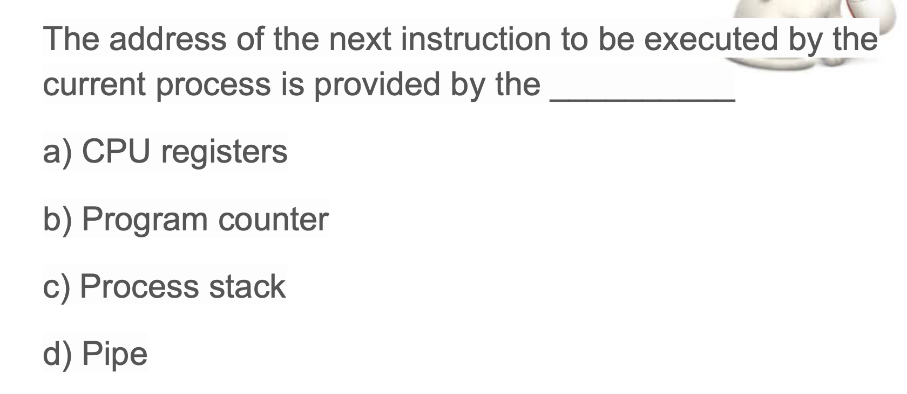

## Process API


- A, if you call `getppid()`, you get parent process ID.


- D


- A

---


- A


- C

---


- A  , 2^3


- B

```c++
#include<stdio.h>
#include<unistd.h>

int main(){
    int i;
    for(i = 0; i < 4; i++){
        fork();
    }
    printf("fork()\n");
    return 0;
}

/* 
fork()
fork()
fork()                                                                                   
fork()
fork()
fork()
fork()
fork()
fork()
fork()
fork()
fork()
fork()
fork()
fork()
fork()

 */
```
---
### How to capture a child's exit code programmming in c


- [wait()](https://novemberfall.github.io/Algorithm-FullStack/operation/wait.html)
- [how to use `exec()`](https://novemberfall.github.io/Algorithm-FullStack/operation/wait.html)


---

- A
  - this system won't return until the child has run and exited. Thus, even when the 
  parent run first, it politely waits for the child to finish running, then wait() 
  returns, and then the parent prints its message.
---


- A, what exactly is going to do it's going to replace the child process address space
  with the program 


---

## Now look at p4.c example

```c++
#include <stdio.h>
#include <stdlib.h>
#include <unistd.h>
#include <string.h>
#include <fcntl.h>
#include <sys/wait.h>

int main(int argc, char *argv[]){
    int rc = fork();
    if (rc < 0) { 	// fork failed; exit
        fprintf(stderr, "fork failed\n");
        exit(1);
    } else if (rc == 0) { // child: redirect standard output to a file
        close(STDOUT_FILENO);
        open("./p4.output", O_CREAT|O_WRONLY|O_TRUNC, S_IRWXU);
        // now exec "wc"...
        char *myargs[3];
        myargs[0] = strdup("wc"); 		// program: "wc" (word count)
        myargs[1] = strdup("./p4.c"); 	// argument: file to count
        myargs[2] = NULL; 		// marks end of array
        execvp(myargs[0], myargs); 	// runs word count
    } else { 			// parent goes down this path (main)
        int wc = wait(NULL);
    }
    return 0;
}
```


- `open("./p4.output", O_CREAT|O_WRONLY|O_TRUNC, S_IRWXU);`
  - what this is doing is it's going to redirect the output to an output file name before
    the output, the output will be directed when output file
- after `close(STDOUT_FILENO);` execute, just basically closing the standard output file
  and redirecting the standard output to a file before the output  

---


- D
---



- B, because after the child process for it will continue execution from the next
  instruction. So the address of the next instruction is in the program counter.
---


- D
---


- A, 注意 是 `nums[i] *= -i`


