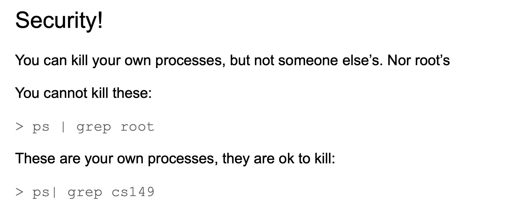

## Process API


- A, if you call `getppid()`, you get parent process ID.


- D


- A

---


- A


- C

---


- A  , 2^3


- B

```c++
#include<stdio.h>
#include<unistd.h>

int main(){
    int i;
    for(i = 0; i < 4; i++){
        fork();
    }
    printf("fork()\n");
    return 0;
}

/* 
fork()
fork()
fork()                                                                                   
fork()
fork()
fork()
fork()
fork()
fork()
fork()
fork()
fork()
fork()
fork()
fork()
fork()

 */
```
---
### How to capture a child's exit code programmming in c


---

- A
  - this system won't return until the child has run and exited. Thus, even when the 
  parent run first, it politely waits for the child to finish running, then wait() 
  returns, and then the parent prints its message.
---

- [reference to `wait()`](https://novemberfall.github.io/Algorithm-FullStack/operation/wait.html)
- [reference to `exec()`](https://novemberfall.github.io/Algorithm-FullStack/operation/wait.html)

---

- A, what exactly is going to do it's going to replace the child process address space
  with the program 


- [reference to `fgets()`](https://novemberfall.github.io/Algorithm-FullStack/C_Pro/fget.html)
- [reference to `execlp()`](https://novemberfall.github.io/Algorithm-FullStack/operation/wait.html)
---


- A, after `execlp()`, what exactly is going to do is to replace the child process address
  space with the new program for `/bin/ls`, as long as `ls` program file running succeed this
  line. `LINE J` should not be run, except there was an error in the calling.

- [reference to `execlp()`](https://novemberfall.github.io/Algorithm-FullStack/operation/wait.html)

---
## With redirection

- Now look at p4.c example

```c++
#include <stdio.h>
#include <stdlib.h>
#include <unistd.h>
#include <string.h>
#include <fcntl.h>
#include <sys/wait.h>

int main(int argc, char *argv[]){
    int rc = fork();
    if (rc < 0) { 	// fork failed; exit
        fprintf(stderr, "fork failed\n");
        exit(1);
    } else if (rc == 0) { // child: redirect standard output to a file
        close(STDOUT_FILENO);
        open("./p4.output", O_CREAT|O_WRONLY|O_TRUNC, S_IRWXU);
        // now exec "wc"...
        char *myargs[3];
        myargs[0] = strdup("wc"); 		// program: "wc" (word count)
        myargs[1] = strdup("./p4.c"); 	// argument: file to count
        myargs[2] = NULL; 		// marks end of array
        execvp(myargs[0], myargs); 	// runs word count
    } else { 			// parent goes down this path (main)
        int wc = wait(NULL);
    }
    return 0;
}
```


- `open("./p4.output", O_CREAT|O_WRONLY|O_TRUNC, S_IRWXU);`
  - what this is doing is it's going to redirect the output to an output file name before
    the output, the output will be directed when output file
- after `close(STDOUT_FILENO);` execute, just basically closing the standard output file
  and redirecting the standard output to a file before the output  

- [reference to redirection | close standard output](https://novemberfall.github.io/Algorithm-FullStack/operation/redirection.html)

---


- D
---


- B, because after the child process for it will continue execution from the next
  instruction. So the address of the next instruction is in the program counter.
---

### this is for assginment 3

- if the child didn't reach the `normal termination` exit point, but instead it was terminated 
  by a signal. Then with the signals Marco, and that would tell you that the child had an 
  `abnormal termination` because there was some signal that happened like maybe there was
  a division by zero, or maybe someone typed kill on the command line.

---

- D
---

## Zombie process
- What is a zombie process?
  - A parent process can wait for the termination of a child process by using the `wait()`
    system call.
  - The `wait()` system call is passed a parameter that allows the parent to obtain 
    the exit status of the child.  

- This system call also returns the process identifier of the terminated child 
  - the parent can tell which of its children has terminated:

```c++
pid_t pid;
int status;
pid = wait(&status);
```

- When a process terminates, its resources are deallocated by the operating system.
- Its entry in the process table must remain there until the parent calls `wait()`, 
  because the process table contains the process's exit status.
- A process that has terminated, but whose parent has not yet called `wait()`,
  is known as a `zombie` process
  - All process transition to this state when they terminate, but usually they exist as zombies
    only briefly.
  - Once the parent calls `wait()`, the process identifier of the zombie process and its entry
    in the process table are relaeased.


#### How to spot(认出) a zombie


- A
---

## Orphan(孤儿) process


#### How to spot an orphaned process

- B




---


- A

---

- A, 注意 是 `nums[i] *= -i`
- 注意：child process doesn't affect the parent, parent has own copy of program


