## Mechanism: Limited Direct Execution

- In order to virtualize the CPU, the operating system needs to somehow share 
  the physical CPU among many jobs running seemingly at the same time. The basic idea is
  simple: run one process for a little while, then run another one, and so forth. 
  By **time sharing** the CPU in this manner, virtualization is achieved.

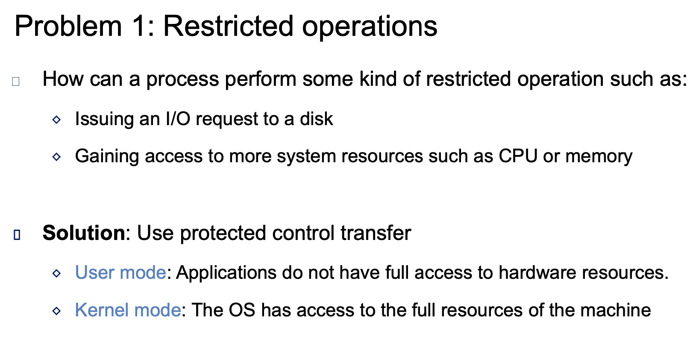

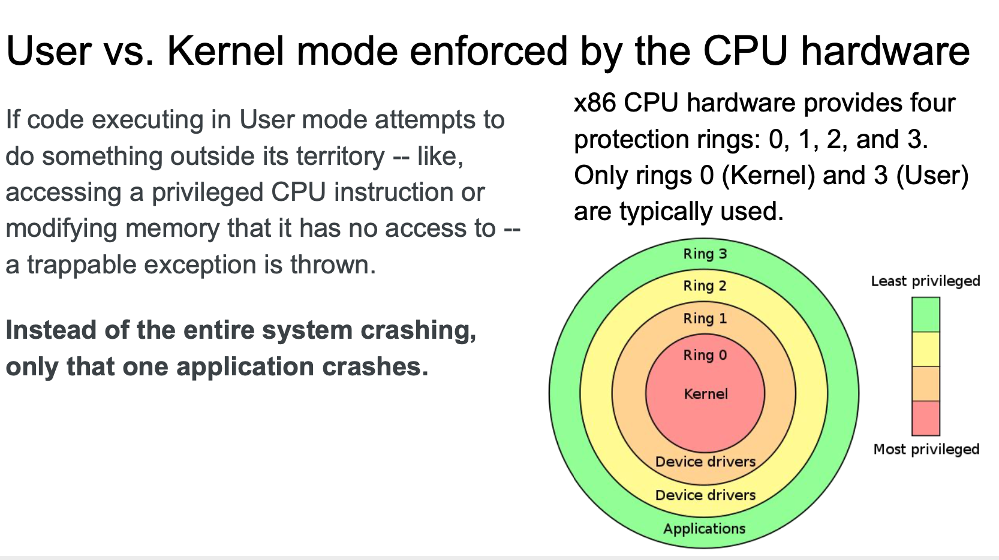

---
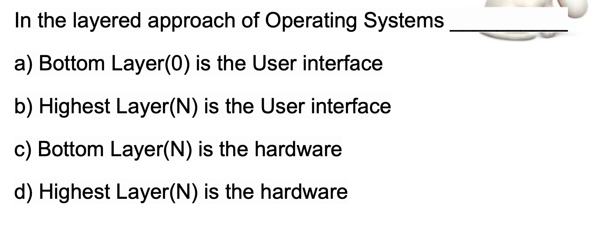
- B
  
---
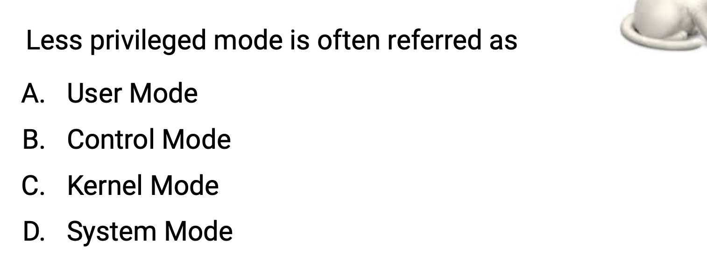
- A

---
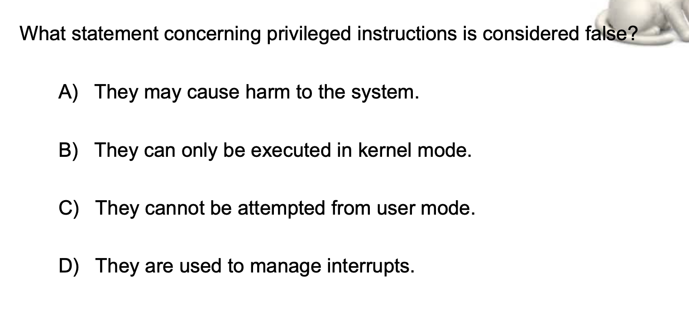
- C, is false, because you can attempt the most trivialized instructions from the 
  user mode, that is fine, but the computer is going to switch from user mode to 
  the kernel mode. For example, if you make a system called like `open a file` or
  `write to a file` that's going to involve switching from the user to the kernel
  mode.

---
## Problem 2: How to switch between processes
- How can the OS regain(恢复) control of the CPU so that it can switch between 
  processes?
  -  A cooperative Approach: Wait for system calls
  -  A Non-Cooperative Approach: The OS takes control

#### A cooperative(合作的) Approach
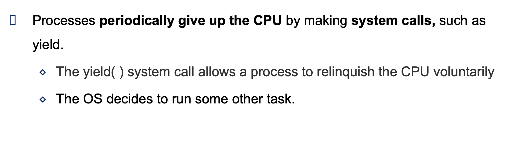

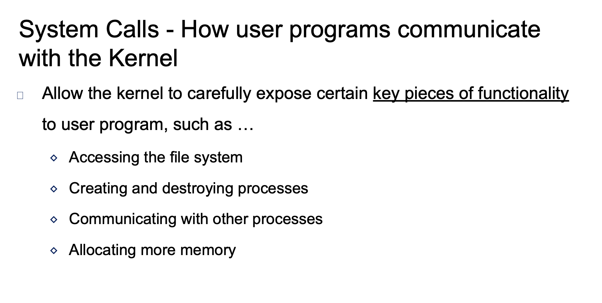

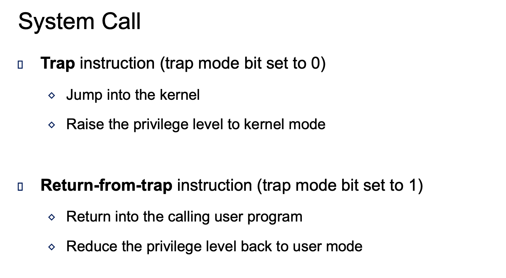

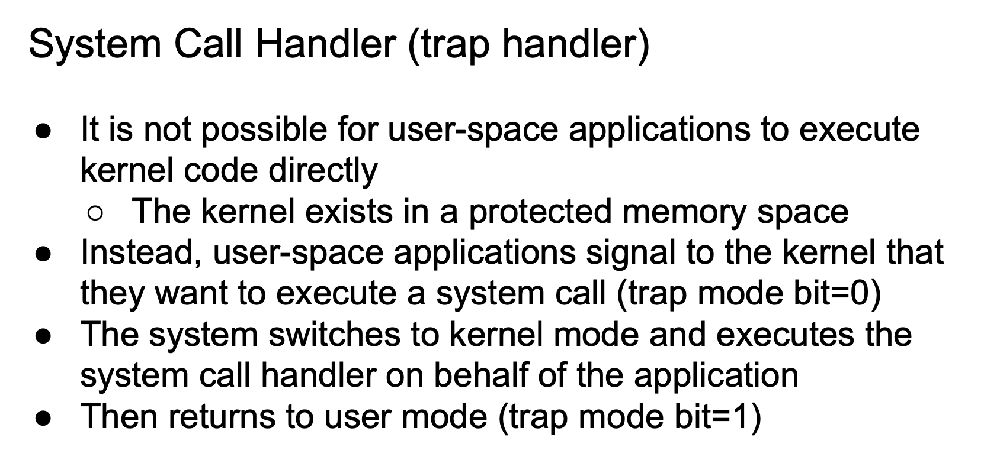

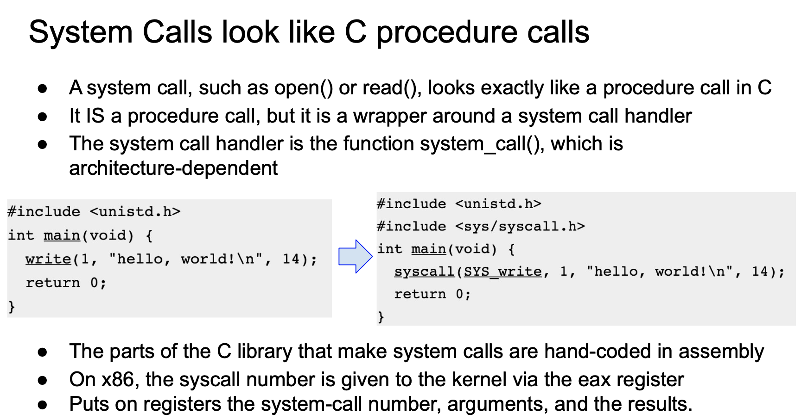

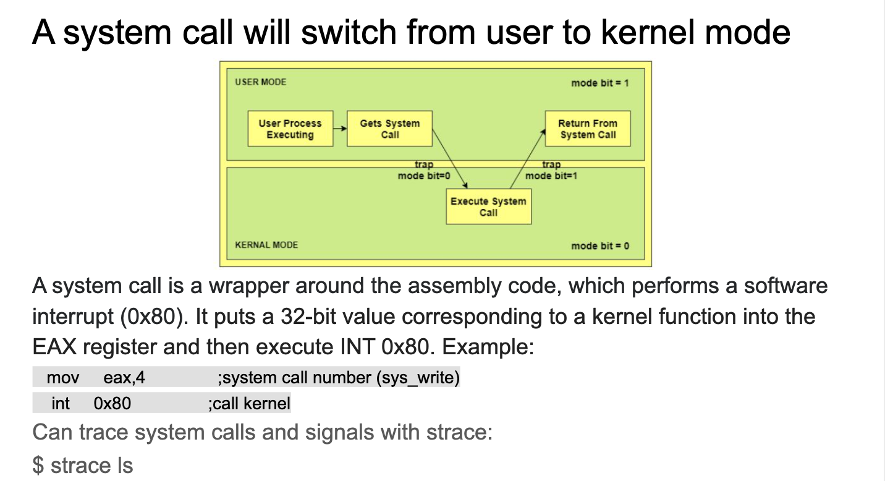
---

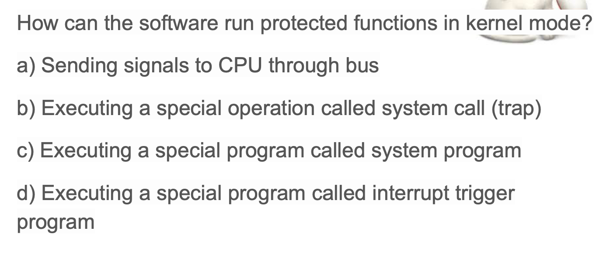

- B

---
## A Non-Cooperative Approach: The OS taks control

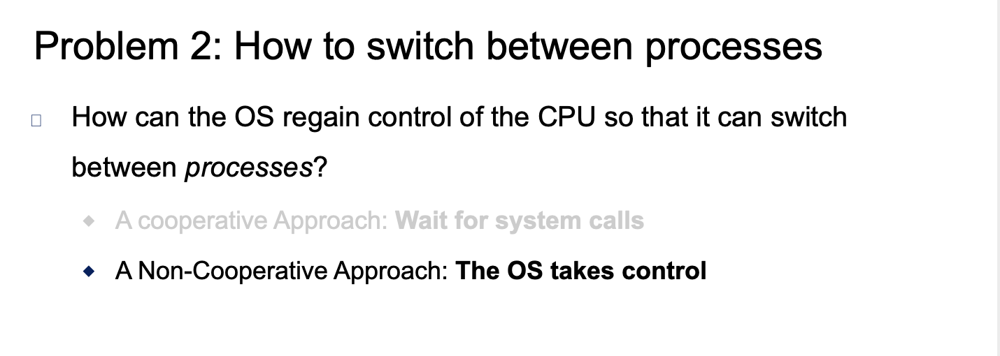

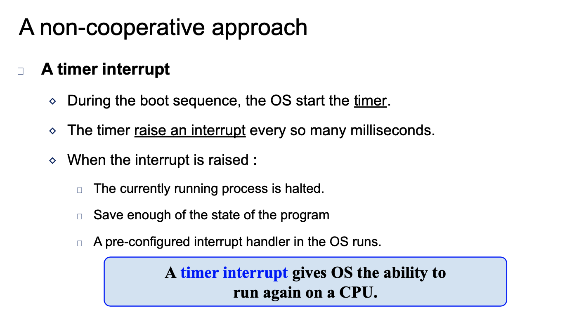

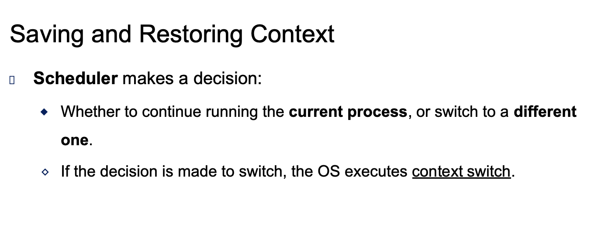

## Context switch

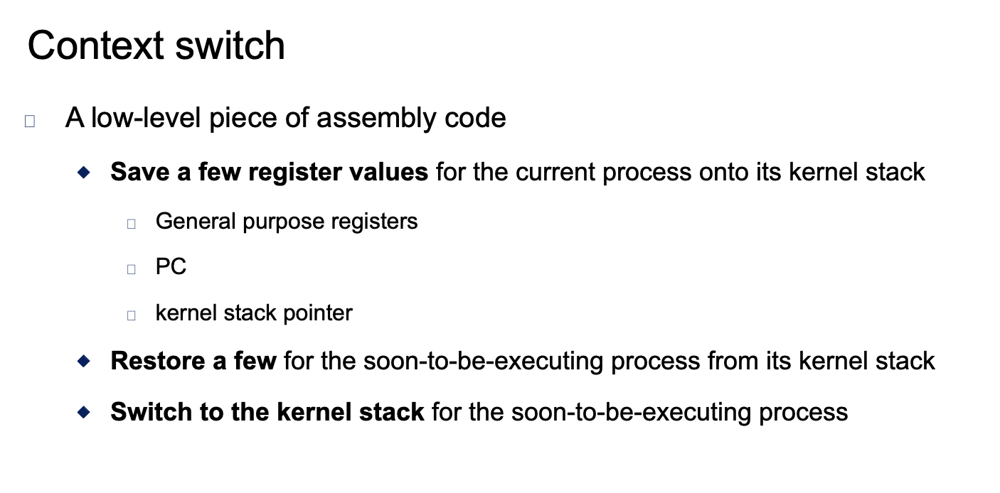

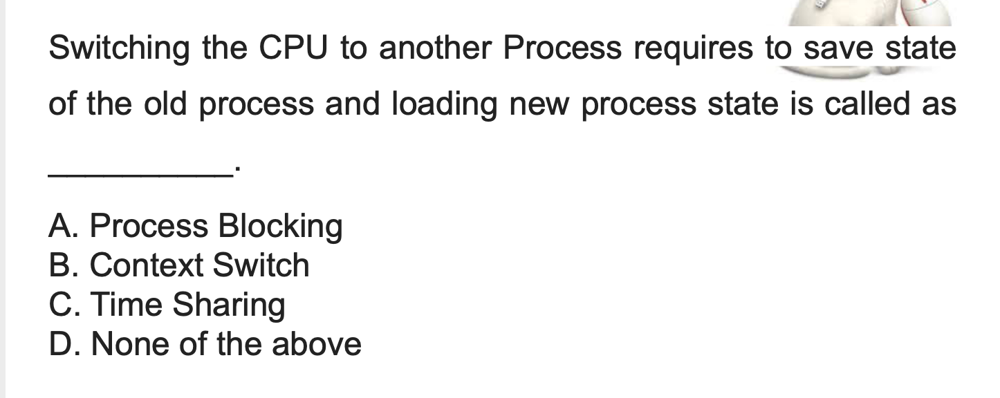
- B

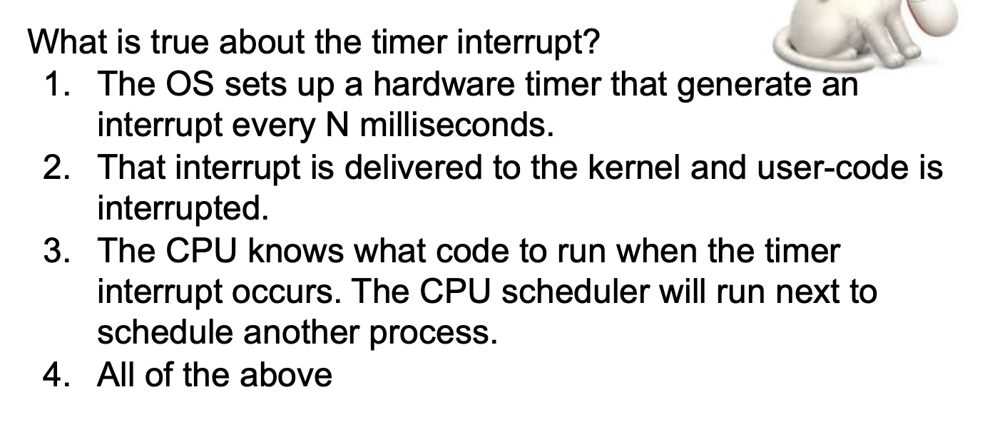
- 4
---

##  Concurrency 并发
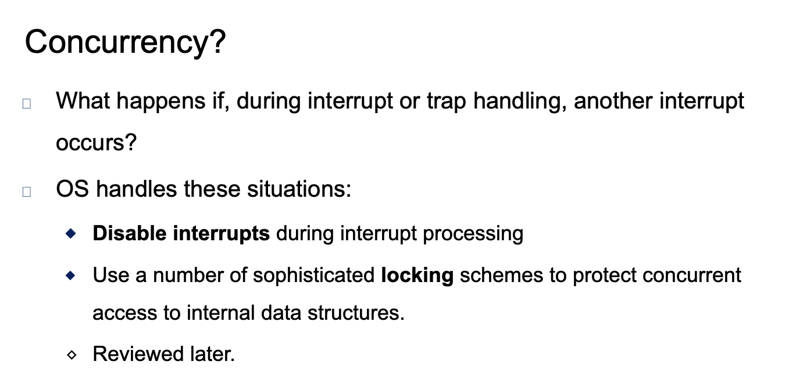

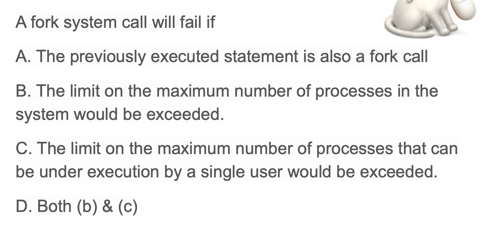
- D

---
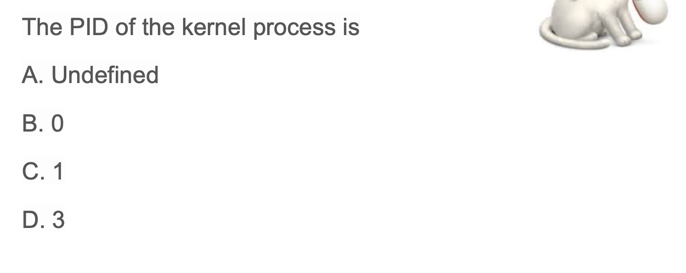
- B
