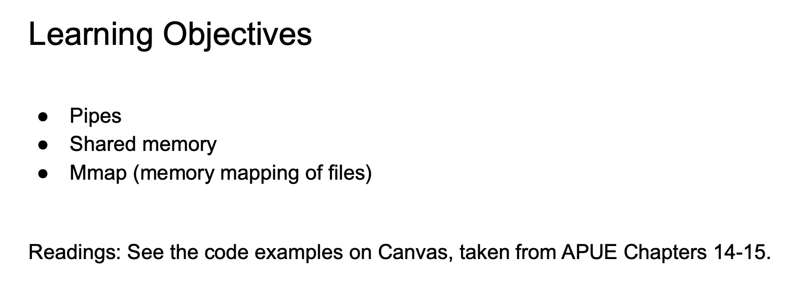
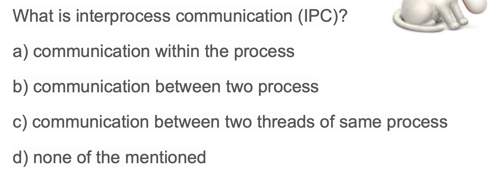
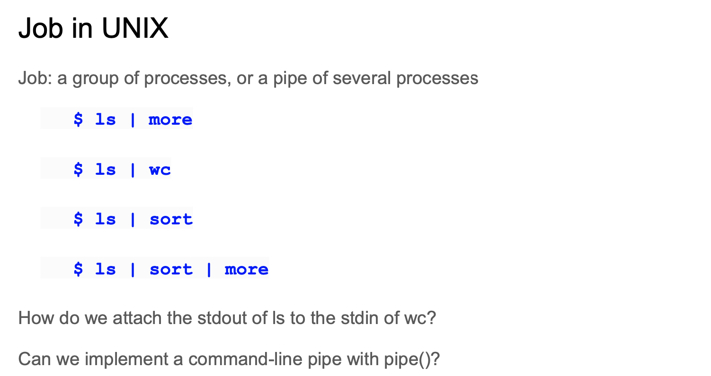
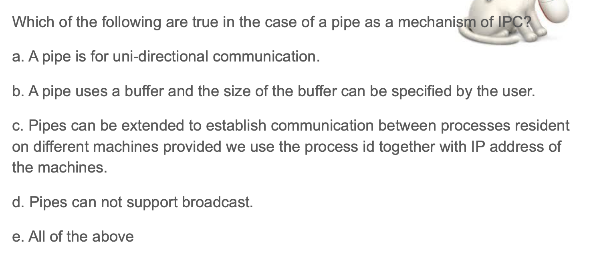
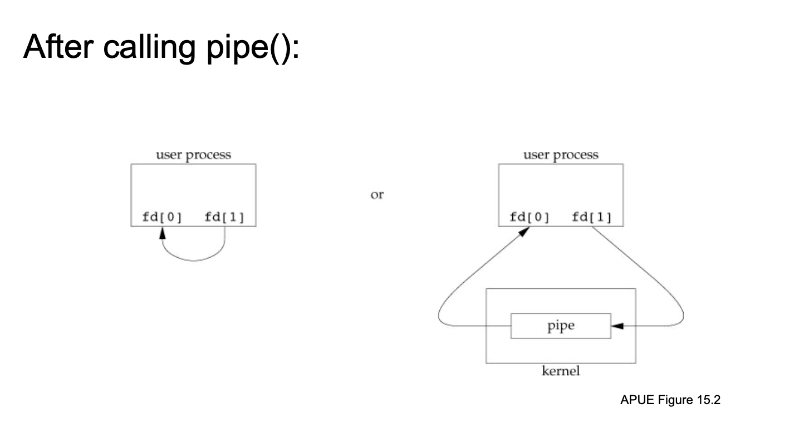
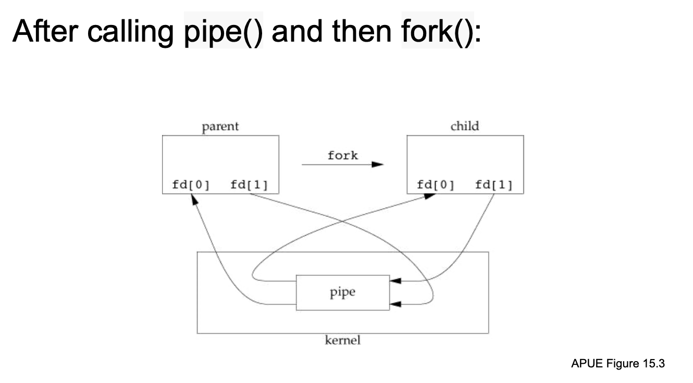
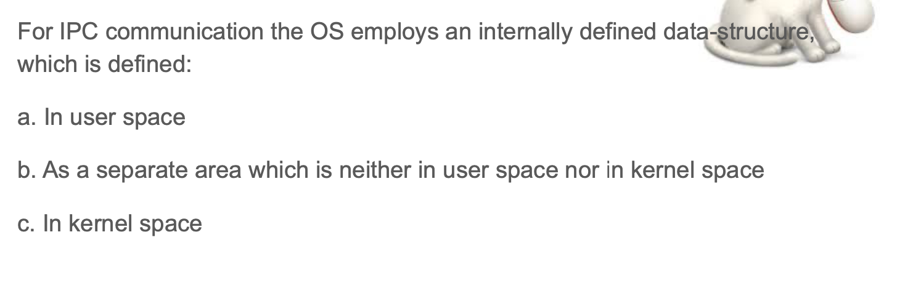
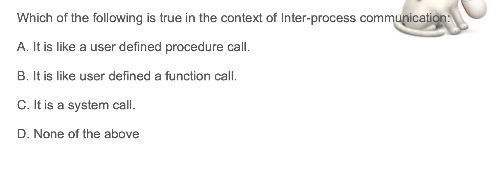
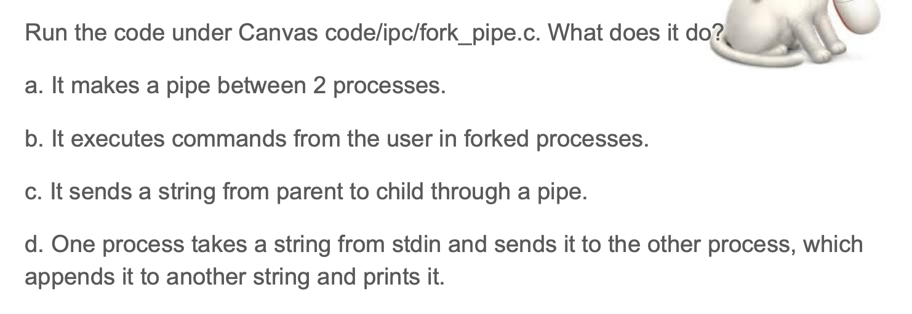

## Inter-Process Communication: Pipes and Memory mapped files (mmap)

- techniques for processes to communicate with one another: interprocess 
  communication (IPC).

- B
---

## Pipes

- To make a `pipe`, put a `vertical bar ()` on the command line between two 
  commands. When a program takes its input from another program, it performs 
  some operation on that input, and writes the result to the `standard output`. 
  It is referred to as a filter.

- [pipe | pipe function](https://novemberfall.github.io/Algorithm-FullStack/operation/pipe.html)

- B

---

- e
  - `uni-directional 意思是单向的`  
  - use can specify the size of buffer
  - c, d 也都是对的 
---

---

- C

- Recall: if parent doesn't use `wait()`, then child is going to end up like
  `zombie process`.

---

- C, if you remember what we saying about system calls, is that they give you 
  a higher level, so you can access things and bigger, so as long as you want
  to define a data structure in `kernel space`, it means that `pipe` has to be
  system call:

---

- AB

---

