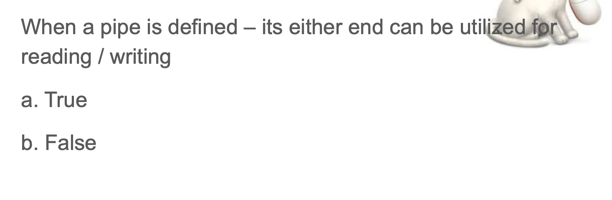

## Inter-Process Communication: Pipes and Memory mapped files (mmap)


- techniques for processes to communicate with one another: interprocess 
  communication (IPC).


- B
---

## Pipes


- To make a `pipe`, put a `vertical bar ()` on the command line between two 
  commands. When a program takes its input from another program, it performs 
  some operation on that input, and writes the result to the `standard output`. 
  It is referred to as a filter.

- [pipe | pipe function](https://novemberfall.github.io/Algorithm-FullStack/operation/pipe.html)



- B

---


- e
  - `uni-directional 意思是单向的`  
  - use can specify the size of buffer
  - c, d 也都是对的 
---


---

- C

- Recall: if parent doesn't use `wait()`, then child is going to end up like
  `zombie process`.

---


- C, if you remember what we saying about system calls, is that they give you 
  a higher level, so you can access things and bigger, so as long as you want
  to define a data structure in `kernel space`, it means that `pipe` has to be
  system call:

---

- AB

---

```c++
int main() 
{ 
    // We use two pipes 
    // First pipe to send input string from parent 
    // Second pipe to send concatenated string from child 
  
    int fd1[2];  // Used to store two ends of first pipe 
    int fd2[2];  // Used to store two ends of second pipe 
  
    char fixed_str[] = "JACOB"; 
    char input_str[100]; 
    pid_t p; 
  
    if (pipe(fd1)==-1) 
    { 
        fprintf(stderr, "Pipe Failed" ); 
        return 1; 
    } 
    if (pipe(fd2)==-1) 
    { 
        fprintf(stderr, "Pipe Failed" ); 
        return 1; 
    } 
  
    scanf("%s", input_str); 
    p = fork(); 
  
    if (p < 0) 
    { 
        fprintf(stderr, "fork Failed" ); 
        return 1; 
    } 
  
    // Parent process 
    else if (p > 0) 
    { 
        char concat_str[100]; 
  
        close(fd1[0]);  // Close reading end of first pipe 
  
        // Write input string and close writing end of first 
        // pipe. 
        write(fd1[1], input_str, strlen(input_str)+1); 
        close(fd1[1]); 
  
        // Wait for child to send a string 
        wait(NULL); 
  
        close(fd2[1]); // Close writing end of second pipe 
  
        // Read string from child, print it and close 
        // reading end. 
        read(fd2[0], concat_str, 100); 
        printf("Concatenated string %s\n", concat_str); 
        close(fd2[0]); 
    } 
  
    // child process 
    else
    { 
        close(fd1[1]);  // Close writing end of first pipe 
  
        // Read a string using first pipe 
        char concat_str[100]; 
        read(fd1[0], concat_str, 100); 
  
        // Concatenate a fixed string with it 
        int k = strlen(concat_str); 
        int i; 
        for (i=0; i<strlen(fixed_str); i++) 
            concat_str[k++] = fixed_str[i]; 
  
        concat_str[k] = '\0';   // string ends with '\0' 
  
        // Close both reading ends 
        close(fd1[0]); 
        close(fd2[0]); 
  
        // Write concatenated string and close writing end 
        write(fd2[1], concat_str, strlen(concat_str)+1); 
        close(fd2[1]); 
  
        exit(0); 
    } 
} 

```

- A C D

