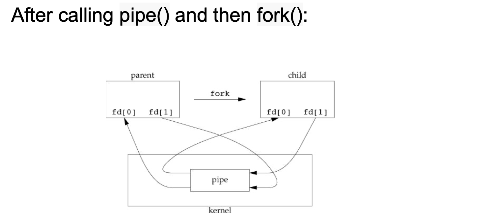
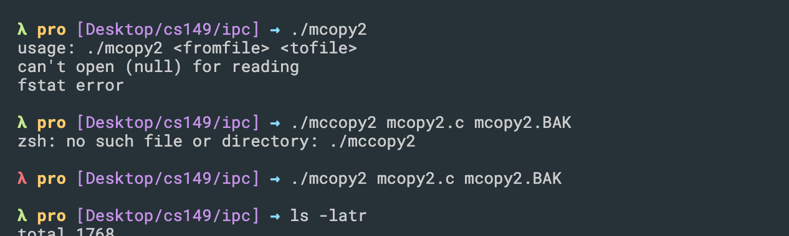
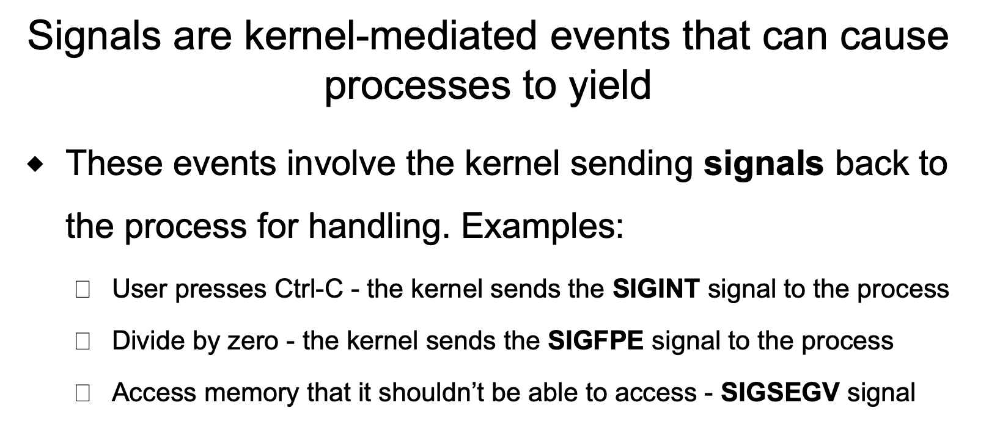

## Inter-Process Communication: Pipes and Memory mapped files (mmap)


- techniques for processes to communicate with one another: interprocess 
  communication (IPC).


- B
---

## Pipes


- To make a `pipe`, put a `vertical bar ()` on the command line between two 
  commands. When a program takes its input from another program, it performs 
  some operation on that input, and writes the result to the `standard output`. 
  It is referred to as a filter.

- [pipe | pipe function](https://novemberfall.github.io/Algorithm-FullStack/operation/pipe.html)


- B

---


- e
  - `uni-directional 意思是单向的`  
  - use can specify the size of buffer
  - c, d 也都是对的 
---


---

- C

- Recall: if parent doesn't use `wait()`, then child is going to end up like
  `zombie process`.

---


- C, if you remember what we saying about system calls, is that they give you 
  a higher level, so you can access things and bigger, so as long as you want
  to define a data structure in `kernel space`, it means that `pipe` has to be
  system call:

---

- AB

---

```c++
int main() 
{ 
    // We use two pipes 
    // First pipe to send input string from parent 
    // Second pipe to send concatenated string from child 
  
    int fd1[2];  // Used to store two ends of first pipe 
    int fd2[2];  // Used to store two ends of second pipe 
  
    char fixed_str[] = "JACOB"; 
    char input_str[100]; 
    pid_t p; 
  
    if (pipe(fd1)==-1) 
    { 
        fprintf(stderr, "Pipe Failed" ); 
        return 1; 
    } 
    if (pipe(fd2)==-1) 
    { 
        fprintf(stderr, "Pipe Failed" ); 
        return 1; 
    } 
  
    scanf("%s", input_str); 
    p = fork(); 
  
    if (p < 0) 
    { 
        fprintf(stderr, "fork Failed" ); 
        return 1; 
    } 
  
    // Parent process 
    else if (p > 0) 
    { 
        char concat_str[100]; 
  
        close(fd1[0]);  // Close reading end of first pipe 
  
        // Write input string and close writing end of first 
        // pipe. 
        write(fd1[1], input_str, strlen(input_str)+1); 
        close(fd1[1]); 
  
        // Wait for child to send a string 
        wait(NULL); 
  
        close(fd2[1]); // Close writing end of second pipe 
  
        // Read string from child, print it and close 
        // reading end. 
        read(fd2[0], concat_str, 100); 
        printf("Concatenated string %s\n", concat_str); 
        close(fd2[0]); 
    } 
  
    // child process 
    else
    { 
        close(fd1[1]);  // Close writing end of first pipe 
  
        // Read a string using first pipe 
        char concat_str[100]; 
        read(fd1[0], concat_str, 100); 
  
        // Concatenate a fixed string with it 
        int k = strlen(concat_str); 
        int i; 
        for (i=0; i<strlen(fixed_str); i++) 
            concat_str[k++] = fixed_str[i]; 
  
        concat_str[k] = '\0';   // string ends with '\0' 
  
        // Close both reading ends 
        close(fd1[0]); 
        close(fd2[0]); 
  
        // Write concatenated string and close writing end 
        write(fd2[1], concat_str, strlen(concat_str)+1); 
        close(fd2[1]); 
  
        exit(0); 
    } 
} 

```

- A C D

---

```c++
int main(void) { 
    int pfds[2]; 
    char buf[30];  
    pipe(pfds);  
    if (!fork()) { 
        printf(" CHILD: writing to pipe\n"); 
        write(pfds[1], "test", 5); 
        printf(" CHILD: exiting\n");
    } else { 
        printf("PARENT: reading from pipe\n"); 
        read(pfds[0], buf, 5); 
        printf("PARENT: read \"%s\"\n" , buf); 
        wait(NULL); 
    }  
    return 0; 
}
```


- Recall: pipe is one direction 
- A, C 

---


```c++
#include "apue.h"
#include <stdio.h>
#include <stdlib.h>
#include <unistd.h>
#include <string.h>
#include <sys/wait.h>

int main(void)
{
	char	buf[MAXLINE];	/* from apue.h */
	pid_t	pid;
	int		status;

	printf("%% ");	/* print prompt (printf requires %% to print %) */
	while (fgets(buf, MAXLINE, stdin) != NULL) {
		if (buf[strlen(buf) - 1] == '\n')
			buf[strlen(buf) - 1] = 0; /* replace newline with null */

		if ((pid = fork()) < 0) {
			printf("fork error");
		} else if (pid == 0) {		/* child */
			execlp(buf, buf, (char *)0);
			printf("couldn't execute: %s", buf);
			exit(127);
		}

		/* parent */
		if ((pid = waitpid(pid, &status, 0)) < 0)
			printf("waitpid error");
		printf("%% ");
	}
	exit(0);
}

```

- B

---

```c++
int main(void)
{
	int		n;
	int		fd[2];
	pid_t	pid;
	char	line[MAXLINE];

	if (pipe(fd) < 0)
		printf("pipe error\n");
	if ((pid = fork()) < 0) {
		printf("fork error\n");
	} else if (pid > 0) {		/* parent */
		close(fd[0]);
		write(fd[1], "hello world\n", 12);
	} else {					/* child */
		close(fd[1]);
		n = read(fd[0], line, MAXLINE);
		write(STDOUT_FILENO, line, n);
	}
	exit(0);
}
```

- A, C

---

```c++
#include "apue.h"
#include<stdio.h>
#include<stdlib.h>
#include<unistd.h>
#include<sys/types.h>
#include<string.h>
#include<sys/wait.h>

#define DEF_PAGER "/bin/more" /* default pager program */

int main(int argc, char *argv[])
{
    int         n;
    int         fd[2];
    pid_t       pid;
    char        *pager, *argv0;
    char        line[MAXLINE];
    FILE        *fp;

    if (argc != 2)
        printf("usage: a.out <pathname>\n");

    if ((fp = fopen(argv[1], "r")) == NULL)
        printf("can't open %s\n", argv[1]);
    if (pipe(fd) < 0)
        printf("pipe error\n");

    if ((pid = fork()) < 0) {
        printf("fork error\n");

    } else if (pid > 0) {       /* parent */

        close(fd[0]);           /* close read end */

        /* parent copies argv[1] to pipe */
        while (fgets(line, MAXLINE, fp) != NULL) {
            n = strlen(line);
            if (write(fd[1], line, n) != n)
                printf("write error to pipe\n");
        }
        if (ferror(fp))
            printf("fgets error\n");

        close(fd[1]);   /* close write end of pipe for reader */

        if (waitpid(pid, NULL, 0) < 0)
            printf("waitpid error\n");
        exit(0);

    } else {            /* child */

        close(fd[1]);   /* close write end */

        if (fd[0] != STDIN_FILENO) {
            if (dup2(fd[0], STDIN_FILENO) != STDIN_FILENO)
                printf("dup2 error to stdin\n");
            close(fd[0]);       /* don't need this after dup2 */
        }

        /* get arguments for execl() */
        if ((pager = getenv("PAGER")) == NULL)
            pager = DEF_PAGER;
        if ((argv0 = strrchr(pager, '/')) != NULL)
            argv0++;            /* step past rightmost slash */
        else
            argv0 = pager;      /* no slash in pager */

        if (execl(pager, argv0, (char *)0) < 0)
            printf("execl error for %s\n", pager);
    }
    exit(0);
}
```

- AD

---


- F

---


```c++
#define COPYINCR (1024*1024*1024)	/* 1 GB */

int
main(int argc, char *argv[])
{
	int			fdin, fdout;
	void		*src, *dst;
	size_t		copysz;
	struct stat	sbuf;
	off_t		fsz = 0;

	if (argc != 3)
		printf("usage: %s <fromfile> <tofile>\n", argv[0]);

	if ((fdin = open(argv[1], O_RDONLY)) < 0)
		printf("can't open %s for reading\n", argv[1]);

	if ((fdout = open(argv[2], O_RDWR | O_CREAT | O_TRUNC,
	  FILE_MODE)) < 0)
		printf("can't creat %s for writing\n", argv[2]);

	if (fstat(fdin, &sbuf) < 0)			/* need size of input file */
		printf("fstat error\n");

	if (ftruncate(fdout, sbuf.st_size) < 0)	/* set output file size */
		printf("ftruncate error\n");

	while (fsz < sbuf.st_size) {
		if ((sbuf.st_size - fsz) > COPYINCR)
			copysz = COPYINCR;
		else
			copysz = sbuf.st_size - fsz;

		if ((src = mmap(0, copysz, PROT_READ, MAP_SHARED,
		  fdin, fsz)) == MAP_FAILED)
			printf("mmap error for input\n");
		if ((dst = mmap(0, copysz, PROT_READ | PROT_WRITE,
		  MAP_SHARED, fdout, fsz)) == MAP_FAILED)
			printf("mmap error for output\n");

		memcpy(dst, src, copysz);	/* does the file copy */
		munmap(src, copysz);
		munmap(dst, copysz);
		fsz += copysz;
	}
	exit(0);
}
```



- 执行完这个程序，复制了原文件到新的文件


- A
---


- A

---

- bi-directional 双向的

---

## Signals


---




---


---


---

 


- look at an example:

```c++
#include "apue.h"
#include<stdio.h>
#include<stdlib.h>
#include<unistd.h>
#include<sys/types.h>
#include<string.h>
#include<sys/wait.h>
static void	sig_usr(int);	/* one handler for both signals */

int main(void)
{
	if (signal(SIGUSR1, sig_usr) == SIG_ERR)
		printf("can't catch SIGUSR1\n");
	if (signal(SIGUSR2, sig_usr) == SIG_ERR)
		printf("can't catch SIGUSR2\n");
	for ( ; ; )
		pause();
}

static void
sig_usr(int signo)		/* argument is signal number */
{
	if (signo == SIGUSR1)
		printf("received SIGUSR1\n");
	else if (signo == SIGUSR2)
		printf("received SIGUSR2\n");
	else
		printf("received signal %d\n", signo);
}
```
- run this program, but it halt there, so we can check its PID
  - open a new terminal: 


- and we can see `received SIGUSR1`

---

- d

---


---


---


---


---


---


---


---


